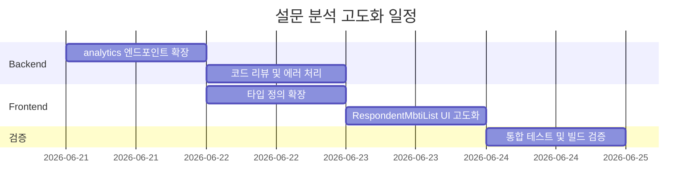

> 상태: PLAN | 작성일: 2026-06-21

---

# 설문 분석 고도화 — 사용자 종합 분석 정보 통합

---

## 1. 개요

**문제점**: 현재 설문 분석 페이지(`SurveyAnalytics`)는 각 사용자의 MBTI만 표시하고, 위험도(risk level), 심리 지수(psych index), 알림 정보 등은 보여주지 않는다. 대시보드(`Dashboard`)에는 위험도만 있고 MBTI/심리지수는 없어, **두 화면이 단절**되어 복지사가 사용자별 종합 현황을 한눈에 파악하기 어렵다.

**목표**: 설문 분석(응답 집계) 페이지에서 각 응답자에 대해 MBTI + 위험도 + 심리 지수 + 알림 정보를 함께 표시하여, 복지사가 개별 사용자의 종합 분석 정보를 통합적으로 확인할 수 있게 한다.

**관련 데이터 흐름**:
```
User 응답 → survey_responses
         → compute_risk_level() → risk level (red/yellow/green)
         → compute_and_store()  → psych index (loneliness/vitality/cognition/relationship/future)
         → analyze_text()       → language metrics (TTR, n-gram, sentence variance)
         → SafetyAlert          → active alert count
```

---

## 2. 현재 상태

### 2-1. 백엔드 API (`GET /surveys/{topic_id}/analytics`)

**현재 반환 구조** (`welfare.py:1120-1249`):
```python
{
  "topic_id": "...",
  "total_respondents": 4,
  "questions": [...],            # 선택형/서술형 통계
  "mbti_distribution": {...},    # 그룹 MBTI 분포
  "respondent_mbti": [           # 개인별 MBTI
    {
      "user_id": "...",
      "nickname": "김어르신",
      "type": "ESFP",
      "is_complete": true,
      "survey_count": 3,
      "total_signals": 12,
    }
  ]
}
```

**개인별 MBTI 반환 루프** (`welfare.py:1231-1247`):
```python
for (uid,) in resp_users.all():
    uid = uuid.UUID(uid) if isinstance(uid, str) else uid
    user = await db.get(User, uid)
    acc = await _accumulate_user_mbti(db, uid)
    respondent_mbti.append({
        "user_id": str(uid),
        "nickname": (user.nickname if user else None) or "익명",
        "type": acc["type"],
        "is_complete": acc["is_complete"],
        "survey_count": acc["survey_count"],
        "total_signals": acc["total_signals"],
    })
```

### 2-2. 사용 가능한 분석 데이터 (현재 미연동)

| 데이터 | 생성 위치 | 현재 사용처 |
|--------|----------|-----------|
| `risk_level` (red/yellow/green) | `compute_risk_level()` in `welfare.py:78-137` | `GET /dashboard` |
| 심리 지수 5종 | `compute_and_store()` in `psych_index.py:97-138` | `GET /users/{id}/detail` |
| 미해결 알림 건수 | `SafetyAlert.resolved == False` | `GET /dashboard` |
| `last_seen_at` | `User.last_seen_at` | `GET /dashboard` |
| `latest_emotion` | `Conversation.emotion_label` | `GET /dashboard` |

---

## 3. 변경 사항

### 3-1. Backend: `welfare.py` — analytics 엔드포인트 확장

**파일**: `C:\dev\contest\ium\backend\app\routers\welfare.py`

**변경 위치**: `get_survey_analytics()` 함수, 개인별 MBTI 루프 (현재 ~line 1231-1247)

**변경 내용**: 각 응답자에 대해 추가 데이터를 조회하여 반환

```python
# 현재 루프:
for (uid,) in resp_users.all():
    uid = uuid.UUID(uid) if isinstance(uid, str) else uid
    user = await db.get(User, uid)
    acc = await _accumulate_user_mbti(db, uid)
    respondent_mbti.append({...})

# 제안:
for (uid,) in resp_users.all():
    uid = uuid.UUID(uid) if isinstance(uid, str) else uid
    user = await db.get(User, uid)
    acc = await _accumulate_user_mbti(db, uid)
    
    # 추가: risk level
    risk_level = await compute_risk_level(uid, db)
    
    # 추가: 심리 지수
    try:
        psych = await compute_and_store(str(uid), db)
    except Exception:
        psych = None
    
    # 추가: 미해결 알림 건수
    alert_cnt = await db.execute(
        select(func.count(SafetyAlert.id))
        .where(SafetyAlert.user_id == uid, SafetyAlert.resolved == False)
    )
    active_alerts = alert_cnt.scalar() or 0
    
    respondent_mbti.append({
        # ... 기존 필드 유지 ...
        "risk_level": risk_level,
        "active_alerts": active_alerts,
        "psych_index": psych,
    })
```

**필요한 import 추가**:
```python
from app.services.psych_index import compute_and_store
from app.models.models import SafetyAlert  # 이미 import 되어 있음
```

**참고**: `compute_risk_level`은 같은 파일에 이미 정의되어 있음 (line 78).

### 3-2. Frontend: `survey.ts` — 타입 확장

**파일**: `C:\dev\contest\ium\dashboard\src\types\survey.ts`

**변경 내용**: `RespondentMbti` 인터페이스에 새 필드 추가

```typescript
export interface RespondentMbti {
  user_id: string;
  nickname: string;
  type: string;
  is_complete: boolean;
  survey_count: number;
  total_signals: number;
  // ---- 추가 ----
  risk_level?: "red" | "yellow" | "green";
  active_alerts?: number;
  psych_index?: {
    loneliness: number;
    vitality: number;
    cognition: number;
    relationship_score: number;
    future: number;
  };
}
```

### 3-3. Frontend: `SurveyAnalytics.tsx` — UI 확장

**파일**: `C:\dev\contest\ium\dashboard\src\components\SurveyAnalytics.tsx`

**변경 내용**: `RespondentMbtiList` 컴포넌트의 각 카드에 위험도 뱃지, 심리 지수 바, 알림 수 표시 추가

**현재 UI**:
```
┌─────────────┐
│ 김어르신     │
│ ESFP        │
│ 설문 3회 · 신호 12 │
└─────────────┘
```

**제안 UI**:
```
┌─────────────────────────┐
│ 김어르신           🔴 긴급 │ ← 위험도 배지 (색상 + 텍스트)
│ ESFP     알림 2건        │ ← MBTI + 알림 수
│ 외로움 ████████░░ 72    │ ← 심리 지수 바
│ 활력   █████░░░░░ 45    │
│ 인지   ███████░░░ 68    │
│ 관계   ███░░░░░░░ 30    │
│ 미래   █████░░░░░ 55    │
│ 설문 3회 · 신호 12       │
└─────────────────────────┘
```

**위험도 배지 색상**:
- `red` → 배경 `#FF4444`, 텍스트 "🔴 긴급"
- `yellow` → 배경 `#FFA500`, 텍스트 "🟡 주의"
- `green` → 배경 `#44BB44`, 텍스트 "✅ 정상"
- `undefined` → 표시 생략

**심리 지수 바**:
- 0~20: `#FF4444` (위험)
- 21~40: `#FFA500` (주의)
- 41~60: `#FFD700` (보통)
- 61~80: `#44BB44` (양호)
- 81~100: `#2196F3` (우수)

---

## 4. 변경 범위 요약

| 파일 | 변경 유형 | 설명 |
|------|---------|------|
| `backend/app/routers/welfare.py` | 수정 | analytics 루프에 risk_level + psych_index + active_alerts 추가 |
| `dashboard/src/types/survey.ts` | 수정 | `RespondentMbti` 타입 확장 |
| `dashboard/src/components/SurveyAnalytics.tsx` | 수정 | `RespondentMbtiList` 카드 UI 확장 (위험도/심리지수/알림) |

**변경 불필요 파일**:
- `Dashboard.tsx` — 기존 위험도 표시 유지 (중복이 아닌 상호보완)
- `psych_index.py`, `alert.py`, `emotion.py` — 기존 로직 그대로 사용
- `welfare.py`의 `compute_risk_level` — 기존 함수 그대로 사용

---

## 5. 위험도 및 고려사항

| 항목 | 내용 |
|------|------|
| **성능** | analytics 루프 내에서 각 사용자별로 DB 쿼리 3회 추가 (risk_level + psych_index + alerts). 사용자 수가 많아지면 응답 시간 증가. **N+1 문제 발생 가능**. 향후 사용자 50명 이상 시 별도 최적화 필요 |
| **N+1 완화 방안** | `compute_risk_level`은 내부에서 여러 쿼리 실행 — 배치(batch) 처리를 위해 별도 함수로 분리하거나 캐싱 고려 |
| **psych_index 계산 비용** | `compute_and_store()`는 14일치 대화 로딩 + 텍스트 분석 수행 — 무거운 연산. 현재는 필요할 때만 계산(on-demand)하도록 유지 |
| **에러 처리** | `compute_and_store` 예외 시 `null` 반환하도록 try/except 유지 — UI에서 graceful fallback |
| **데이터 신선도** | risk_level과 psych_index는 호출 시점마다 실시간 계산 — 동일 사용자에 대해 중복 계산 발생할 수 있음 |

---

## 6. 테스트 계획

| 테스트 | 방법 |
|--------|------|
| 백엔드 API 응답 검증 | `GET /surveys/{topic_id}/analytics` 호출 후 `respondent_mbti` 배열에 `risk_level`, `psych_index`, `active_alerts` 필드 존재 확인 |
| 프론트엔드 빌드 | `npm run build` 통과 확인 |
| UI 표시 확인 | 각 사용자 카드에 위험도 뱃지, 심리 지수 바, 알림 수가 올바르게 표시되는지 육안 확인 |
| 에러 케이스 | psych_index 계산 실패 시 UI에서 해당 섹션 생략되는지 확인 |

---

## 7. 수행 계획


