# 제4회 문화체육관광 인공지능·데이터 활용 공모전
## — 문화데이터 활용 분야 —

> ⚠️ 검토용 — 기존 `2. 기획서_이음.docx`의 내용을 바탕으로, 협의한 개선(구성도·표·실제 화면 배치)을 반영한 버전입니다.

---

**공모 부문**: ☑ 아이디어 부문

**아이디어 명**: 이음(以音) — 지역문화 데이터로 잇는 세대공감 AI 사회안전망

---

## 1) 아이디어 소개(요약)

이음(以音)은 '지역문화 데이터'를 매개로 은둔 청년과 독거노인을 잇는 AI 사회안전망이다. 매주 문화 빅데이터 플랫폼의 지역 설화·지명유래·옛 사진을 '세대공감 대화 주제'로 발행하면, 두 세대가 같은 문화 기억을 떠올리며 대화·설문에 참여한다. AI는 그 대화에서 감정·인지·성향(MBTI) 지표를 분석해 고독사·고립 위기를 조기 감지하고 복지사에게 연결하며, 모인 이야기를 한 편의 수필로 엮어 세대를 잇는다. 청년의 사회 단절과 노인의 고독사라는 두 사회문제를, 문화가 가진 '공감의 힘'으로 동시에 푸는 것이 목표다.

---

## 2) 아이디어 상세 설명

### ■ 문제의식 — 따로 떨어진 세 위기를 하나로 잇는다

- 노인 고독사 — 1인 가구 노인 급증으로 관계 단절이 고독사로 이어지나, 안부 확인은 사람 발품에 의존해 사각지대가 넓다.
- 청년 고립·은둔 — 사회와 단절된 은둔형 외톨이 청년이 늘지만, 이들을 끌어낼 '역할·동기' 설계가 부족하다.
- 세대 단절 — 서로의 자원이 될 수 있는 두 세대가 만날 접점이 없다.

<table><tr><td align="center">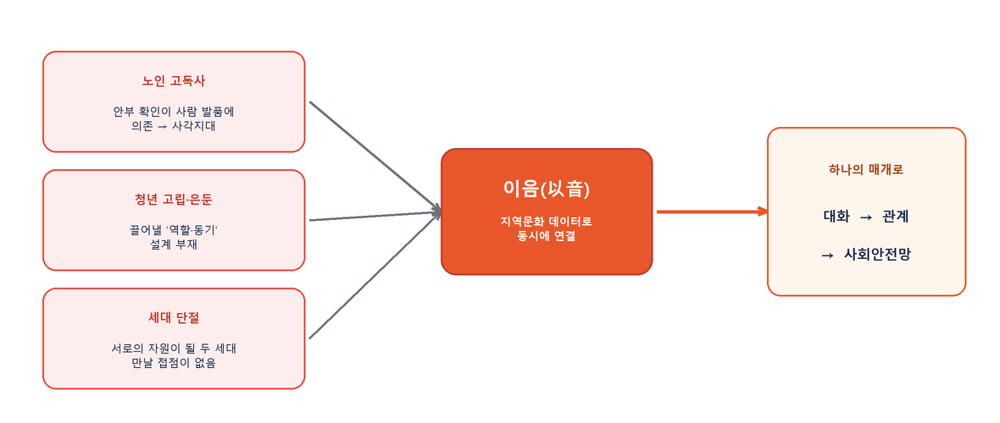 <i>세 문제를 '지역문화 데이터'라는 하나의 매개로 동시에 연결</i></td></tr></table>

### ■ 핵심 사용자 흐름 — 7단계 파이프라인

<table><tr><td align="center">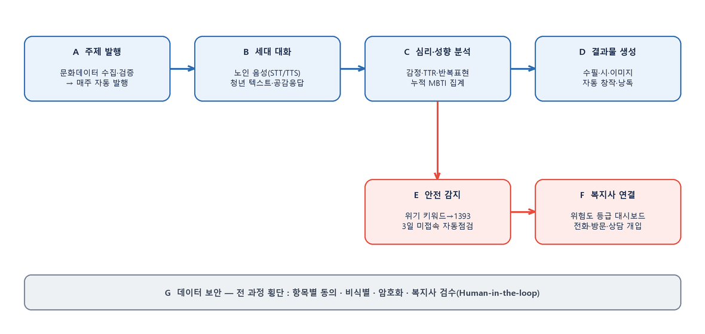</td></tr></table>

각 단계의 주요 기능은 다음과 같다.

| 단계 | 주요 기능 |
|------|-----------|
| **A 주제 발행** | 공공 문화데이터(문화 빅데이터 플랫폼·국가기록원·민속아카이브) 자동 수집·검증·캐싱 → 지역별 맞춤 주제 매주 자동 발행(스케줄러) · AI 설문 생성(선택·서술·혼합형, 보기별 MBTI 성향 태깅, 자동·수동 미리보기, 복지사 검수·AI 협의(refine) 후 발행) |
| **B 세대 대화** | 노인 음성(STT→AI→TTS)·청년 텍스트·음원 재생, 글자 크기 등 접근성, AI 공감 응답으로 대화 지속 |
| **C 심리·성향 분석** | 감정 분석, 어휘 다양성(TTR)·반복표현(치매 조기 신호), 누적 MBTI/성향 집계 |
| **D 결과물 생성** | 모인 대화 → 수필·시·소설·이미지 생성, 기여자 추적, 음성 낭독 전달 |
| **E 안전 감지** | 위기 키워드 감지→1393 연결, 3일 접속 단절·감정 악화 자동 점검(매일 09:00), 복지사 이메일 알림 |
| **F 복지사 연결** | 위험도 점수 등급(긴급/주의/정상), 주제 확인 현황, 개입(전화·방문·상담·알림해결) 이력, 설문 분석·응답 조회, 회원·복지사 관리 |
| **G 데이터 보안** | 개인정보 항목별 동의, 대화 비식별·암호화, 복지사 검수(Human-in-the-loop) — 전 과정 횡단 |

### ■ 노인·청년 모바일 앱 화면

<table>
<tr>
<td align="center">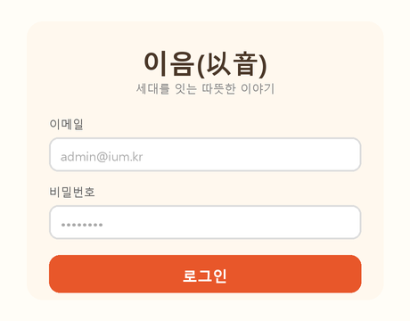 <b>로그인 (공통)</b> 이메일 인증 후 사용자 유형(노인/청년)별 맞춤 홈으로 분기.</td>
<td align="center">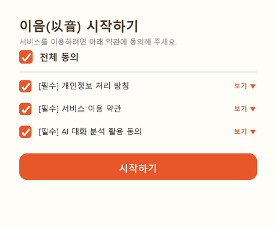 <b>개인정보 보호·이용 동의</b> 처리방침·약관·AI분석을 항목별 동의. 비식별·복지사 열람 명시로 신뢰 확보.</td>
<td align="center">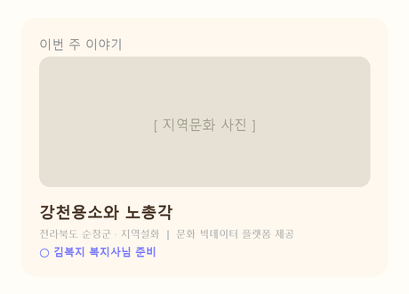 <b>세대공감 주제 카드(노인)</b> 매주 지역문화 '이번 주 이야기'를 큰 글씨·사진으로 제시, 진입 시 음성(TTS) 안내.</td>
</tr>
<tr>
<td align="center">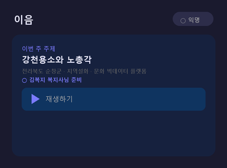 <b>청년 화면(익명·다크)</b> 익명 배지로 부담 없이 참여, 음원 주제는 바로 재생.</td>
<td align="center">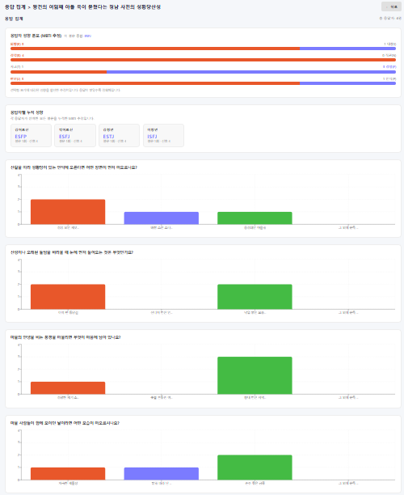 <b>참여 통계 보기</b> 응답 분포를 막대그래프로 보여 '같은 생각을 한 사람들'과의 연결감 형성.</td>
<td align="center">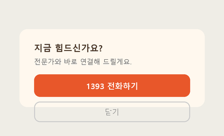 <b>위기 감지·1393 긴급 연결</b> 위기 신호 감지 시 자살예방상담 1393 연결·복지사 알림 팝업.</td>
</tr>
</table>

### ■ 복지사 웹 대시보드 화면

<table>
<tr>
<td align="center">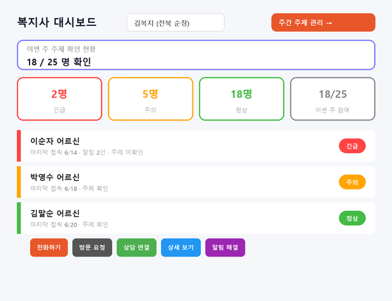 <b>복지사 대시보드 — 실시간 모니터링</b> 담당자별 위험도(긴급/주의/정상) 점수 등급, 주제 확인 현황, 전화·방문·상담·알림해결 등 개입 이력 관리.</td>
<td align="center">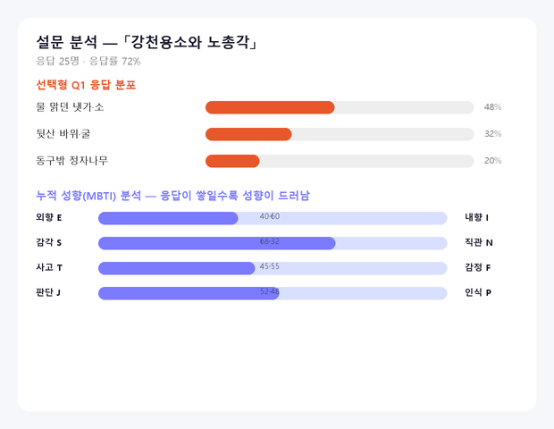 <b>설문 분석 — 응답 통계+누적 MBTI</b> 응답률·선택 분포와 함께 누적 성향(MBTI 4축)을 시각화해 대상자 이해를 돕는다.</td>
</tr>
<tr>
<td align="center">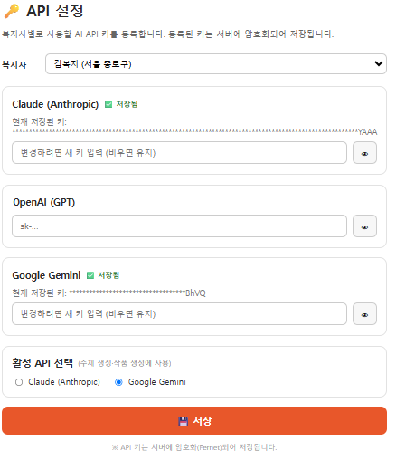 <b>멀티 AI 공급자·키 관리</b> Claude·GPT·Gemini·OpenCode 등록, 실패 시 자동 전환(Fallback)으로 서비스 연속성 확보.</td>
<td align="center">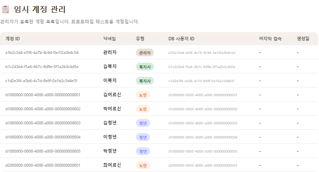 <b>회원·복지사 관리</b> 복지사 등록, 담당 노인·청년 배정/해제, 역할(현장/상위 관리자) 관리.</td>
</tr>
</table>

---

## 3) 아이디어 독창성

> *심사 관점: 기술이 아니라 '구조'가 새로운가?*

**① 문화데이터를 '소비 콘텐츠'가 아니라 '관계·돌봄의 촉매'로 재정의** — 기존 문화데이터 서비스는 추천·전시·관광 등 '보여주기'에 머문다. 이음은 같은 데이터를 세대 간 대화를 여는 열쇠이자 심리 상태를 읽는 진단 도구로 사용한다.

**② 두 사회문제(청년 고립 + 노인 고독사)를 하나의 구조로 동시 해결** — 노인은 말벗을, 청년은 사회적 역할을 얻는 상호 호혜 설계. 한쪽을 돕는 행위가 다른 쪽의 치유가 된다.

**③ '향수 → 자연스러운 자기노출 → 심리 진단'의 비침습적 모니터링** — 직접적 우울·외로움 설문 대신, 옛 기억을 떠올리는 문화 대화 속에서 감정·인지·성향을 자연스럽게 수집해 거부감을 낮춘다.

**④ 대화의 수필화로 '데이터가 다시 문화가 되는' 선순환** — 문화데이터에서 출발한 대화가 새로운 창작물(수필)로 환원되어 다시 세대를 잇는다.

### ■ 실제 데이터 기반 — 구상이 아닌 실증

- 현재 DB에 전국 지역문화 데이터 **189건(이미지 101·텍스트 88)**이 실제 적재되어, 아래와 같은 실존 주제로 설문이 생성된다.
  예: '강천용소와 노총각'(전북 순창군·지역설화) / '황골엿과 황골 엿술'(강원 원주·향토음식) / '성북동 이종석 별장'(서울·한국의 가옥) / '주왕산지'(경북 청송·기록문화)
- 추출된 TOP10 키워드(역사/인물 25 · 전통가옥 13 · 생활/문화 11 · 불교/문화유산 10 · 이야기/설화 9 …)로 복지사가 지역·테마를 골라 맞춤 발행한다. 같은 데이터가 세대공감 대화와 성향 분석으로 직결되는 점이 독창적이다.

---

## 4) 아이디어 발전 가능성 및 기대효과

### ■ 구현·사업화 실현 가능성 — 이미 작동하는 MVP로 검증 완료

본 아이디어는 구상에 그치지 않고, 실제 동작하는 프로토타입(MVP)으로 핵심 파이프라인을 구현·검증했다. 사업화 시 '개념 검증' 단계를 이미 통과한 상태이며, 지자체·복지관 실증(파일럿)으로 곧바로 확장 가능하다.

<table><tr><td align="center">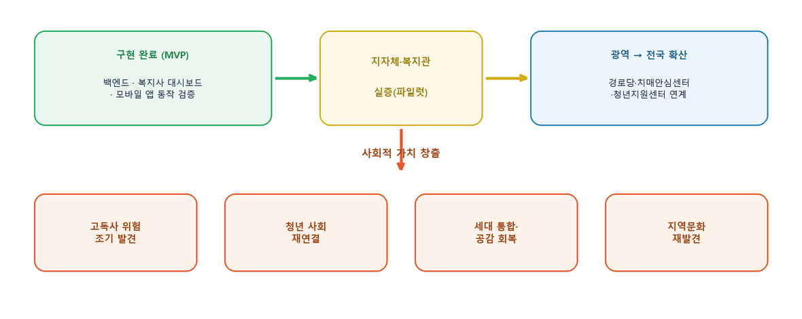</td></tr></table>

- **백엔드(FastAPI)** — 공공 문화데이터 API 연동, AI 주제·질문 자동 생성, 감정·위기 감지, 수필 생성, 복지사 알림(이메일/스케줄러) 동작
- **복지사 대시보드(React)** — 주제 발행·설문 관리·대상자 심리지표·위험도 모니터링 화면 구현
- **모바일 앱** — 노인 음성 대화·청년 텍스트 대화, 위기 시 1393 연결 팝업 구현

### ■ 사회적 가치 (정성적 기대효과)

| 가치 | 내용 |
|------|------|
| 고독사 예방 | 비대면 안부·심리 모니터링으로 위기를 조기 포착, 복지 사각지대 축소 |
| 청년 사회 재연결 | '누군가에게 필요한 존재'라는 역할 경험으로 은둔 탈출 동기 부여 |
| 세대 통합 | 문화 기억을 공유하며 세대 간 이해와 공감 회복 |
| 지역문화 가치 재발견 | 잊혀가던 지역 설화·지명유래가 일상 대화 속에서 다시 살아남 |
| 사회적 포용 | 디지털 약자(노인 음성 UI)·다문화·비수도권 지역문화까지 포괄하는 포용적 설계 |

### ■ 정량적 기대효과 (실증 단계 KPI)

복지사 1인당 모니터링 가능 대상자 수 증가(수기 점검 → 대시보드 자동 집계), 위기 감지 소요시간 단축(정기 방문 → 실시간), 주당 대화·수필 생성 건수 등 참여 지표 측정.

### ■ 확장성·파급효과

| 구분 | 내용 |
|------|------|
| 데이터 확장 | 음원(국악)·영상 등 멀티미디어 문화데이터 및 다국어(다문화가정)로 확대 |
| 산업 결합 | 시니어 케어·디지털 헬스케어·지역문화 콘텐츠 산업과 결합 |
| 공공 인프라화 | 지자체·경로당·치매안심센터 연계 공공 돌봄 인프라화 |
| 확산 경로(사업화) | 지자체·복지관 B2G 실증 → 효과 검증 후 광역 확대 → 경로당·치매안심센터·청년지원센터 연계로 전국 확산 |

### ■ ESG 실현 가능성

| 구분 | 실현 내용 |
|------|-----------|
| 사회(S) | 청년 사회참여 역할 창출·복지 인력 보조로 일자리 기여, 디지털 격차·다문화·지역 균형 등 포용성 제고 |
| 환경(E) | 비대면 안부·모니터링으로 대면 방문 부담을 줄여 이동·탄소 저감에 기여 |
| 지배구조(G) | 대화 데이터 비식별·암호화 및 복지사 검수(Human-in-the-loop)로 윤리적 AI 운영 |

---

## 5) 문화데이터 활용

### ■ 활용 데이터

| 활용 데이터(명) | 제공기관 | 플랫폼 | URL |
|------|------|------|-----|
| **[필수] 지역문화 멀티미디어 데이터**(설화·전설·지명유래·옛 사진) | 한국문화정보원 | 문화 빅데이터 플랫폼 | `[[데이터셋 상세 URL 기입]]` |
| (선택·융복합) 국가기록원 나라기록물정보 | 국가기록원 | 공공데이터포털 | (API 연동) |
| (선택·융복합) 국립민속박물관 민속아카이브 | 국립민속박물관 | 문화공공데이터광장 | (API 연동) |

<table><tr><td align="center">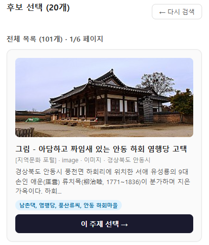 <b>실제 적재된 문화데이터 — 주제 후보 선택 화면</b> 후보 101건 중 선택(예: 안동 하회 염행당 고택). 이미지 101 + 텍스트 88 = 총 189건.</td></tr></table>

### ■ 실제 활용 규모 (MVP 적재 기준)

분기별 원천 데이터(2022.12~2023.12) 5종을 수집·병합 → 이미지 주제 101건 + 텍스트 주제 88건, **총 189건**의 지역문화 콘텐츠를 실제 적재하고 TOP10 키워드를 추출해 운용.

### ■ 활용 방식 (전처리·가공·연계)

- **수집** — 문화 빅데이터 플랫폼에서 지역문화 데이터(CSV)를 내려받고, 국가기록원·민속아카이브 API를 실시간 연동
- **전처리** — 이미지 URL 유효성 검증, 설화 텍스트 정제, 미디어 로컬 캐싱
- **분할·구조화** — 이미지 유무로 image/text 주제 분류, 핵심 키워드(TOP10) 추출 → 복지사 대시보드 필터로 제공
- **AI 가공** — 데이터의 제목·설명·키워드를 AI에 입력해 연령대별 세대공감 대화 질문으로 변환

> **데이터의 역할** — 문화데이터는 ①대화를 여는 '주제', ②심리·성향을 읽는 '진단 매개', ③수필 창작의 '소재'라는 3중 역할을 수행한다. 즉, 단순 표시 대상이 아니라 세대를 잇고 위기를 감지하는 서비스의 작동 원리 그 자체다.

---

## 6) AI 기술 활용

### ■ 적용 영역별 AI 기술

| 영역 | 기술 | 역할 |
|------|------|------|
| 주제·질문 생성 | 멀티프로바이더 LLM(Claude·GPT·Gemini) + 프롬프트 엔지니어링 | 문화데이터 → 연령 맞춤 세대공감 질문(선택/서술/혼합형) 자동 생성 |
| 세대 대화 | LLM 대화 엔진 + STT/TTS | 노인 음성↔텍스트 변환, 연령·역할별 페르소나 응답 |
| 심리 분석 | 감정분류 모델(KR-FinBert) + 언어패턴(TTR·n-gram) + 성향(MBTI) | 대화에서 감정·인지·성향 지표 추출 |
| 위기 감지 | 위기 키워드 탐지 + 규칙·패턴 분류 | 자해·고립 신호를 high/medium/low로 분류해 대응 분기 |
| 수필 생성 | 생성형 LLM | 다수의 대화를 한 편의 수필로 자동 창작 |

### ■ 이음만의 AI 운영 특징

- **다중 AI 공급자 자동 전환(Fallback)** — 한 AI가 실패해도 다른 공급자로 자동 전환해 서비스 연속성 확보
- **결정적 프롬프트 + 견고한 파싱** — 코드블록·산문이 섞인 AI 응답도 구조화 JSON으로 안정 추출
- **사람 개입(Human-in-the-loop)** — 복지사가 AI 생성 주제·질문을 검토·수정·발행하는 자동/수동 미리보기 체계로 품질·안전성 보장

### ■ 프롬프트 요청 방법과 수령 양식

- **요청** — 질문 유형별 프롬프트 템플릿에 주제·대상·미디어 유형을 자동 대입해 '결정적 프롬프트'를 만들어 LLM에 전달. AI 연결이 어려운 환경을 위해, 같은 프롬프트 원문을 화면에 출력하고 복지사가 외부 AI 답변을 붙여넣는 '수동 미리보기'도 지원한다.
- **수령** — 질문 유형·선택지별 MBTI 성향 태그를 포함한 구조화 JSON(설문 세트) 양식으로 받는다. 코드블록·설명이 섞인 응답도 견고하게 파싱해 화면 미리보기로 변환한다.

### ■ 구현 화면 — 위 AI 기술이 실제 작동하는 모습 (①→⑩)

<table>
<tr>
<td align="center">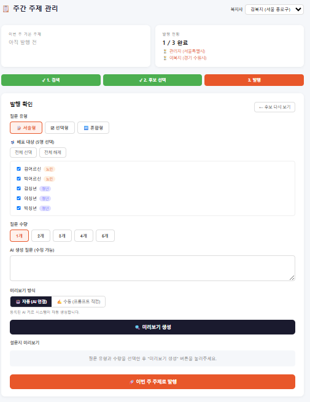 <b>① 복지사 — AI 질의 생성</b> 주간 주제 관리에서 '성황당산성' 등 지역문화 주제를 넣으면 AI가 연령 맞춤 설문을 자동 생성(자동/수동 미리보기).</td>
<td align="center">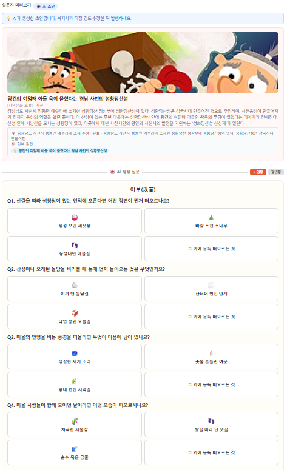 <b>② AI 생성 초안 검수·협의</b> 보기마다 숨은 MBTI 태그까지 생성. AI와 대화로 다듬어(refine) 발행 전 완성도를 높인다.</td>
</tr>
<tr>
<td align="center">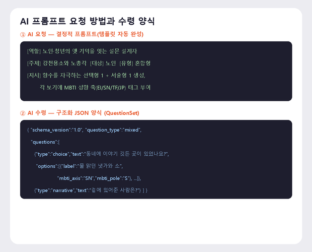 <b>③ 프롬프트 요청·수령 양식</b> 템플릿 자동완성 '결정적 프롬프트' 요청 → 구조화 JSON(설문 세트) 수령.</td>
<td align="center">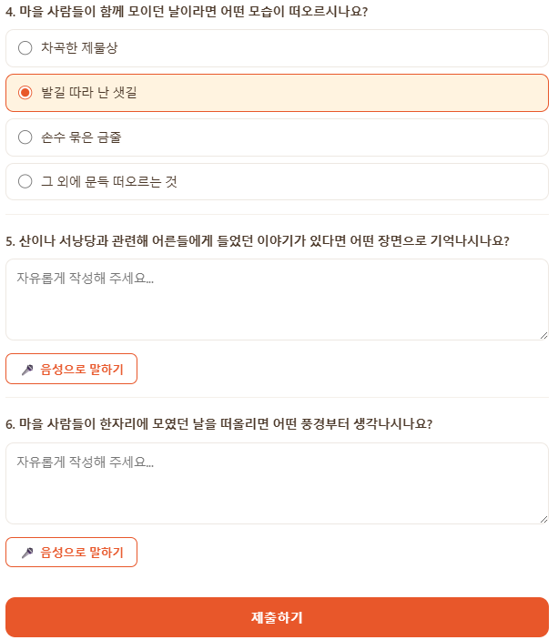 <b>④ 노인 — 질의서(선택+음성)</b> AI가 만든 향수 자극 선택형. 보기마다 숨은 MBTI 태그로 성향 데이터 수집, 못다 한 말은 음성으로.</td>
</tr>
<tr>
<td align="center">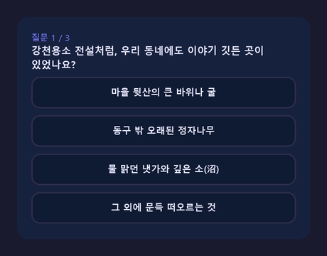 <b>⑤ 청년 — 질의서(선택형)</b> 동일 설문을 청년 감성 다크 테마로 제공.</td>
<td align="center">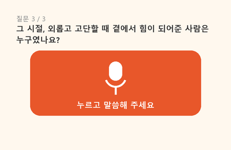 <b>⑥ 서술형 음성 설문 답변</b> 버튼을 누르고 말하면 STT로 텍스트화. 어르신도 음성으로 서술 응답.</td>
</tr>
<tr>
<td align="center">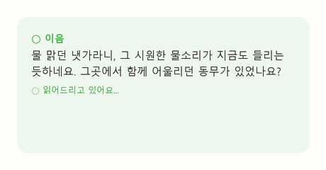 <b>⑦ AI 공감 응답</b> 응답 분석 후 후속 질문으로 대화 유도(노인은 TTS 자동 재생).</td>
<td align="center">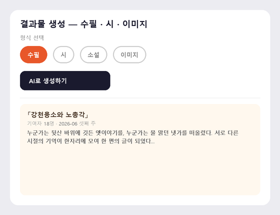 <b>⑧ 결과물 생성 페이지</b> 모인 대화로 수필·시·이미지를 AI가 생성.</td>
</tr>
<tr>
<td align="center">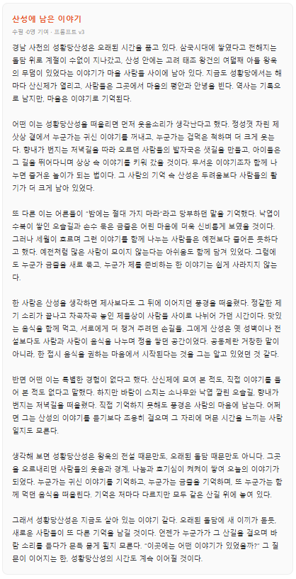 <b>⑨ 결과물 — 수필</b> 여러 세대의 이야기가 한 편의 글('산성에 남은 이야기')로 재탄생, 음성 낭독 지원.</td>
<td align="center">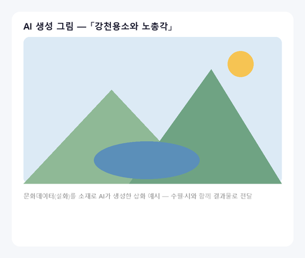 <b>⑩ 결과물 — AI 그림</b> 같은 주제를 삽화로도 생성해 수필·시와 함께 전달.</td>
</tr>
</table>
